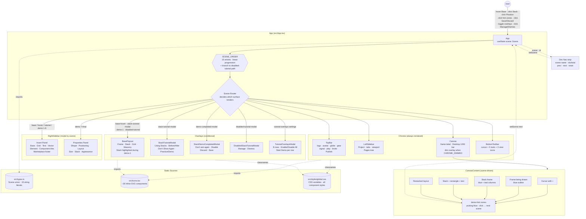

# Framer Redesign — Tutorial Overlays
**SCAD UXDG 380 — [Project Name TBD]**

> A Figma-like onboarding pass for Framer's Insert menu — hover, demo, dismiss, or manage.

---

## Design Argument

**TBD.** *(One or two paragraphs explaining the redesign's intent: who it's for, what current Framer behavior frustrates them, and why a guided overlay/tutorial system inside the Insert panel is the right intervention.)*

---

## Research Documentation

*Evidence gathered about the Person, the Problem, and the surrounding context — interviews, observations, references, alternatives surveyed. Student-authored.*

**TBD.**

---

## Platform Rationale

**TBD.** *(Paragraph explaining why this is being built as a desktop web prototype rather than a mobile or in-app experience — likely tied to Framer being a desktop design tool itself.)*

---

## AI Direction Log

*Decisions where AI was directed, with what was asked for, what came back, and what was kept or changed. Covers the full arc from pipeline setup to last-mile polish.*

| # | Date | Prompt | AI Output | Decision | Notes |
|---|------|--------|-----------|----------|-------|
| 1 | 2026-05-18 | "We are working on a redesign of Framer to make it more Figma-like" + 17 Figma reference screenshots (base, hover, tutorial modal, 8-step Stack demo, completion, disabled-tutorial path, settings panel). | Scaffolded Vite + React + TypeScript app in the empty `tinale21/Framer` repo. Built the full chrome (TopBar, LeftSidebar with project tree, Canvas with frame label, RightSidebar Insert panel, BottomToolbar pill) plus all five overlay surfaces: Base hover popout, "Using Stacks" tutorial modal with Before/After comparison, 8-step demo with hint affordances, "Stack Demo Completed!" modal, "Disabled Stacks Tutorial" modal, and "Tutorial Overlays" settings. State-machine drives all 17 scenes; dev-nav strip in the bottom-right for jumping between scenes. | **Kept** | Foundation for everything that follows. Inline SVG icons (no icon library dep), CSS variables for the design tokens, vanilla CSS in `src/styles/global.css`. |
| 2 | 2026-05-18 | "Set up README, files, and pipeline like my other previous projects." | Added GitHub Actions workflow for Pages deploy, set `vite.config.ts` base to `/Framer/`, copied CC0 LICENSE, scaffolded `claude/` directory matching PersonsRequired structure, rewrote this README with the standard sections. | **Kept** | Same deploy shape as [PersonsRequired](https://github.com/tinale21/PersonsRequired) — `npm ci → npm run build → upload-pages-artifact → deploy-pages`. |

---

## Records of Resistance

*Every product-level moment where AI output was rejected, significantly revised, or where AI deliberately declined a default. Grouped by checkpoint in chronological order. Pipeline-setup and README-related checkpoints are excluded because they speak to project plumbing or documentation, not the prototype itself. Detailed context for every entry lives in [`claude/checkpoints/`](claude/checkpoints/).*

*(No product-level resistance moments yet — the initial checkpoint was greenfield scaffolding from the 17 Figma reference screens. Entries will accumulate as iteration on visual fidelity, interaction details, and surface decisions progresses.)*

---

## Five Questions Reflection

### Can I defend this?
**TBD.**

### Is this mine?
**TBD.**

### Did I verify?
**TBD.**

### Would I teach this?
**TBD.**

### Is my documentation honest?
**TBD.**

---

## Post-Mortem

*Written reflection on the full Design Cycle for this project. Student-authored.*

**TBD.**

---

## Mermaid Diagram

What receives input, how the system processes it, and what it outputs. The state machine drives every visible surface; the right side shows the static data, asset, and icon sources that components read from at render time.

---

## User Testing Evidence

*Photos, recordings, quotes, and observations from putting the prototype in front of Framer users (or a target user). Student-authored.*

**TBD.**

---

## Live URL

https://tinale21.github.io/Framer/

*(Live after the first push to `main` triggers the Pages workflow. Enable Pages → Source: GitHub Actions in repo settings if the deploy fails on the first run.)*
